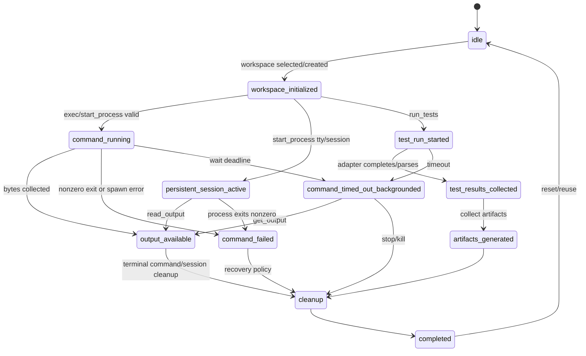
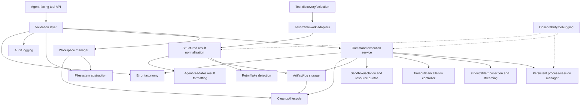
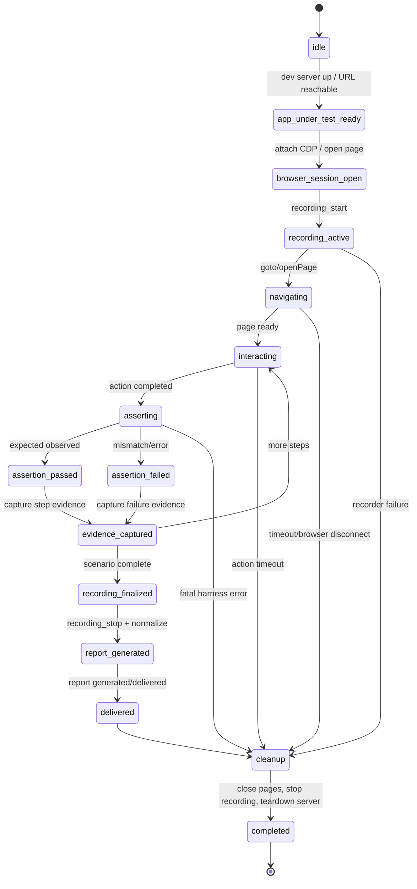

# Clean-room execution and test-automation harness blueprint

## 1. Executive summary

This document specifies a clean-room implementation of the externally visible behavior documented in `OBSERVATIONS.md`. It deliberately does not claim knowledge of proprietary internals. **[Observed]** The reference environment exposes shell execution, persistent process I/O, file operations, and search; it has no first-class test-runner tool, so tests are invoked through shell execution and produce ordinary text. **[Inferred]** A compatible implementation can reproduce the public boundary with a local command service, a persistent-session manager, file/search adapters, and optional result normalizers. **[Proposed]** The design below adds explicit structured test APIs, isolation, quotas, artifacts, normalized results, and a web-application E2E layer as safer clean-room extensions rather than representing them as existing behavior.

**[Proposed]** The web-testing layer consists of a Browser Automation Service, Recorder, and Report Generator built on the observed browser/CDP, `computer`, `browser_console`, and recording primitives. It remains an external-behavior reproduction and orchestration design, not a claim about proprietary internals.

Compatibility priorities are: exact request validation, bash exit semantics, merged output, one-shot versus persistent state, timeout backgrounding, incremental reads, file-tool edge cases, and ordinary Unix permission behavior. Security controls marked production-only must not be mistaken for properties of the reference environment.

## 2. Capability inventory

The following table separates directly evidenced behavior from design recommendations.

| Tool | Purpose | Input contract | Output contract | Error behavior | Timeouts/limits | State persistence; mode | Security boundary | Non-obvious behavior |
|---|---|---|---|---|---|---|---|---|
| `exec` | **[Observed]** Run a bash command. | **[Observed]** `command:string`; optional `shell_id:string`, `tty:boolean`, `timeout:number`, `workdir:string`, `env:Record<string,string>`. **[Unknown]** Full schema defaults and validation. | **[Observed]** Text including command output and `Exit code: N`; background response includes shell ID. | **[Observed]** Missing command gives rc 127; missing `ls` target gives rc 2. Wrapper reports the last command's status. | **[Observed]** Timeout may return after about the requested duration and background rather than kill. Exact caps **[Unknown]**. | One-shot: **[Observed]** no cross-call state. `shell_id`+TTY: **[Observed]** persistent cwd/env/PID. Synchronous until timeout; then asynchronous session. | **[Observed]** unprivileged `ubuntu`, normal Unix DAC; no repo-boundary jail observed. **[Proposed]** sandbox. | **[Observed]** stdout/stderr are merged and ordering is not guaranteed. `(exit 7); echo` returns 0. |
| `get_output` | **[Observed]** Read a background/persistent shell. | **[Observed]** `shell_id:string`; optional `timeout:number`, `incremental:boolean` (default true is **[Observed]**). | **[Observed]** Incremental unified diff by default; completed command output and exit code. | **[Unknown]** Exact invalid-ID error contract. | **[Unknown]** Maximum wait and output cap; long timeout can await completion. | **[Observed]** Reads session state; streaming-like polling, not a continuous stream. | Same process boundary as `exec`. | **[Observed]** Subsequent default reads return changes since last read. |
| `write_to_process` | **[Observed]** Send input to an interactive process. | **[Observed]** `shell_id:string` and exactly one of `text_input:string` or `bytes_input:string`; special tokens such as `<CR>` are supported by the tool contract. | **[Observed]** No guaranteed output itself; use `get_output`. | **[Unknown]** Exact no-process and mutually-exclusive-input errors. | **[Unknown]** Write timeout/byte limits. | **[Observed]** persistent session; interactive REPL worked. | Process has reference user privileges. | **[Observed]** Python REPL received code across calls and returned evaluated values. |
| `kill_shell` | **[Observed]** Terminate a running shell. | **[Observed]** `shell_id:string`. | **[Observed]** success text such as `Shell <id> terminated successfully`. | **[Unknown]** Idempotency and missing-ID errors. | **[Unknown]** Kill grace period. | Session lifecycle mutation; synchronous result. | **[Proposed]** Must kill descendants and enforce ownership. | **[Observed]** Used to terminate background shell. |
| `read` | **[Observed]** Read UTF-8 text file. | **[Observed]** `file_path:string`; `offset`, `limit` are documented by tool context but exact defaults **[Unknown]**. | **[Observed]** Numbered file-view text. Symlinks are followed. | **[Observed]** missing path and non-UTF-8 binary return validation failures. | **[Unknown]** line/byte limits; long lines may truncate per docs. | **[Observed]** no process state; filesystem effects persist. | **[Observed]** normal Unix permissions; no path allowlist observed. | **[Observed]** symlink target content is returned. |
| `write` | **[Observed]** Create or overwrite a file. | **[Observed]** `file_path:string`, `content:string`. | **[Observed]** creation success text. | **[Observed]** permission failure on read-only file. | **[Unknown]** content-size limit. | Filesystem persistent. | Normal Unix DAC. | **[Observed]** creates and overwrites. |
| `edit` | **[Observed]** Exact string replacement. | **[Observed]** `file_path:string`, `old_string:string`, `new_string:string`, `replace_all:boolean` (default false **[Observed]**). | **[Observed]** success text. | **[Observed]** not found; non-unique without replace-all; identical strings; permission denied. | **[Unknown]** file size and replacement limits. | Filesystem persistent. | Normal Unix DAC; follows ordinary file permissions. | **[Observed]** edit can follow a prior write without a separate read. |
| `MultiEdit` | **[Observed]** Sequential exact replacements in one file. | **[Observed]** file plus ordered edits; exact schema **[Unknown]**. | **[Observed]** intended atomic sequential result; not independently re-tested in this session. | **[Observed]** each old string must be unique after prior edits, per schema docs. | **[Unknown]** operation count/size limits. | Filesystem persistent; one logical call. | Normal Unix permissions. | **[Observed]** sequential application is significant. |
| `grep` | **[Observed]** ripgrep-backed search. | **[Observed]** `pattern`, `path`, optional `glob_pattern`, `output_mode`, `case_insensitive`, `context_lines`, `max_results`. | **[Observed]** grouped matches with line numbers. | **[Unknown]** exact invalid regex/path errors. | **[Unknown]** result and pattern limits. | No process state; reads filesystem. | Normal Unix permissions. | **[Observed]** case-sensitive by default; `case_insensitive` changes it. |

**[Observed]** Runtime facts: Linux/Ubuntu; Node `v20.18.1`, Bun `1.3.14`, `npx`, and `python3` are present; Python lacks the `pytest` module. **[Observed]** `node --test` emits TAP v13 with subtest status, skip, duration, location, failure metadata, stack, and summary. **[Inferred]** Any framework can run when its executable/dependencies exist, but the reference harness itself does not parse framework output.

## 3. Experiment log

| Experiment | Hypothesis | Exact operation | Observed result | Conclusion | Confidence | Open questions |
|---|---|---|---|---|---|---|
| Exit code of last command | Wrapper reports final shell status. | Run `false`; run `(exit 7); echo`; run failing `node --test` followed by `echo`, capture `$?`. | `false` -> 1; trailing `echo` -> 0; runner rc captured as 1 but wrapper was 0. | Shell command is executed as a compound bash command and reports its last status. | High | Whether shell options such as `pipefail` are enabled. |
| Missing commands/files | Native bash/Unix errors survive. | Invoke nonexistent command and `ls` on missing file, each followed by `echo`. | Native rc 127 and 2; wrapper 0 with trailing echo. | Errors are ordinary command errors, not normalized test failures. | High | Exact error text across hosts. |
| stdout/stderr ordering | Streams may be merged nondeterministically. | Print one marker to stderr and one to stdout. | stderr marker appeared before stdout marker despite source ordering. | Consumer must not promise cross-stream ordering. | High | Whether capture uses a PTY versus pipes in every mode. |
| One-shot state | One-shot calls are isolated. | `cd` and set env in one call; run `pwd`/env in another from `/home/ubuntu`. | Second call started in `/home/ubuntu` without prior state. | No implicit one-shot session persistence. | High | Default cwd if caller omits it elsewhere. |
| Workdir | `workdir` controls cwd. | Invoke `pwd` with `workdir=/home/ubuntu/harness-fixture`. | Printed requested directory. | Workdir is applied before command. | High | Symlink and nonexistent-workdir validation. |
| Env injection | Per-call env is visible. | Set `FIXTURE_VAR` through `env`, print it. | Value was visible. | Environment injection works. | High | Merge versus replacement semantics for inherited env. |
| Persistent PID/cwd/env | Shell ID retains process state. | Set env and cwd; later print env, cwd, and PID with same `shell_id`, `tty:true`. | Same PID (5271 in experiment), cwd and env retained. | Persistent shell is a stateful process session. | High | Session expiration and concurrent writers. |
| Interactive REPL stdin | Input can be sent later. | Start `python3 -i`; send code through `write_to_process`; read with `get_output`. | Results `42` and `[0,1,4,9]` returned. | Persistent interactive input/output works. | High | PTY echo and signal semantics. |
| Timeout/backgrounding | Timeout kills command. | Run `sleep 30` with `timeout=3000ms`, then poll. | Initial call returned after ~3s with “Command running in background”; later read returned `done sleeping`, rc 0. | Timeout stops waiting and backgrounds; it does not kill. | High | Idle/total background timeout defaults and process tree policy. |
| Kill | Shell can be terminated. | Call `kill_shell` on running background shell. | “Shell <id> terminated successfully”. | Explicit cancellation is available. | High | Exit status and descendant cleanup. |
| Output overflow | Huge output is stored out-of-line. | Emit ~50,000 short lines and compare with ~1,050 lines. | ~4KB was inline; multi-MB output showed head/tail preview and full content under `.devin-files/.../content.txt`; long lines were truncated. | Inline output has a byte/size cap and overflow artifact. | High | Exact threshold, preview policy, retention and opaque naming. |
| Read symlink/missing/binary | File read is text-safe and follows links. | Read `link.txt`, missing path, and non-UTF8 binary. | Link returned target text; missing and binary returned validation failures. | UTF-8 validation occurs; symlink follows normal resolution. | High | Encoding/BOM behavior and offset units. |
| Write/edit | File mutation has exact replacement rules. | Write file; edit absent, duplicate, identical, and chmod 444 file. | Not found; non-unique; identical; permission denied. Prior write allowed edit without intervening read. | Exact replacement and Unix permission errors are observable. | High | Atomicity under concurrent writers. |
| Grep | Search defaults to case-sensitive. | Search `DUP` and `beta` in fixture with default options. | `DUP` missed lowercase `dup`; `beta` matched. | Default matching is case-sensitive. | High | Regex flags, binary handling, symlink traversal. |
| Host boundary | Harness enforces repository jail. | Read `/etc/hostname`, write `/tmp`, attempt write `/`, access fixture outside repo. | System read and `/tmp` write succeeded; `/` write denied; outside-repo fixture access succeeded. | Boundary was normal Linux DAC, not an observed repo allowlist. | High | Other users, devices, namespaces, network access. |
| Node test output | Node runner is parseable TAP. | Run `node --test` on fixture. | TAP v13, `ok/not ok`, skip, duration, location, failure details, summary; failure rc 1. | A normalizer can parse TAP, but reference tool returns text. | High | Version-specific TAP extensions. |
| Pytest availability | Python test adapter is ready. | Import pytest using system `python3`. | Module not found. | Pytest requires installation or a different environment. | High | Whether other Python environments contain pytest. |

## 4. State-machine model

**[Proposed]** The model below names lifecycle states for a clean-room harness. **[Observed]** The reference demonstrates idle shell calls, active persistent sessions, output polling, timeout backgrounding, termination, and test output; structured test states are design additions.



**[Proposed]** Triggers are validated requests, process spawn, output arrival, exit, deadline, cancellation, parser completion, and cleanup. Persisted state includes workspace metadata, session PID/handles, byte offsets, exit info, and artifact references; one-shot command state is discarded after response. Failure transitions preserve diagnostics and never silently convert a process failure to a passing test. Retries are explicit, bounded, and only for classified retryable failures; a repeated request carries an idempotency key. Concurrent reads may be allowed, but writes to one session and overlapping workspace mutations should be serialized. Cleanup is idempotent: terminating an already-exited process and deleting already-removed artifacts produce a stable “already complete” outcome.

## 5. Architecture

**[Proposed]** Architecture for a compatible, safer implementation:



Component list: agent-facing API; validation; workspace manager; filesystem abstraction; command execution; persistent sessions; output collection; timeout/cancellation; test adapters; discovery/selection; normalization; retry/flake detection; artifact/log storage; sandbox; quotas; audit log; cleanup; error taxonomy; result formatting; observability.

## 6. Component designs

The following are **[Proposed]** designs, except where explicitly marked **[Observed]**.

| Component | Responsibilities and public interfaces | Data/dependencies/lifecycle | Failure modes, security, approach, alternatives |
|---|---|---|---|
| API | JSON request/response dispatch; `dispatch(tool, request)`. | Request ID, auth context, schema registry; request→validate→execute→format. | Invalid JSON, overload, timeout. Validate before side effects; use JSON Schema/Zod. Alternative gRPC adds typing but reduces shell compatibility. |
| Validation | Types, defaults, bounds, path and session ownership checks. | Tool schemas and normalized request. | Injection is not solved by validation; reject NULs, invalid IDs, absurd limits. TypeScript Zod is practical; JSON Schema is language-neutral. |
| Workspace manager | Create/select/status/reset workspace; `workspace_status`, `reset_environment`. | Workspace record, root, owner, locks, cleanup policy. | Path races and deletion mistakes; use per-run directories and allowlisted roots. Git worktrees are an alternative. |
| Filesystem abstraction | Read/write/edit/list/search with symlink and UTF-8 policy. | File handles, byte limits, replacement plans; depends on OS/filesystem. | Traversal, symlink races, permissions; open with no-follow where isolation requires. Native FS is simple; virtual FS is safer but less compatible. |
| Command execution | Spawn bash commands and report process lifecycle. | Command record, argv/string, cwd, env, exit info. | Shell injection is intentional capability; use sandboxed unprivileged process, explicit policy. Direct exec avoids shell semantics but is incompatible with `bash`. |
| Session manager | Persistent PID/PTY/pipe, stdin writes, incremental offsets. | Session map, ring buffer, sequence numbers, locks. | Hung process, concurrent input, leaked descendants; process groups and ownership. PTY improves REPL compatibility; pipes simplify parsing. |
| Output collection | Merge stdout/stderr, previews, incremental reads, overflow files. | Chunk log, cursor, byte/line counters, artifact pointer. | Unbounded memory and encoding; quota, UTF-8-safe preview, append-only storage. |
| Timeout/cancellation | Deadline, background transition, stop/kill. | Timers, cancellation token, process-group ID. | Race at exit/deadline; atomically record winner and make cancellation idempotent. |
| Test adapters | Invoke Jest/Vitest/Pytest/Go/Cargo/TAP and identify format. | Adapter registry and command builder. | Missing runner, malformed output; return raw logs plus parse error. Generic exec is fallback; adapters improve UX. |
| Discovery/selection | Map user selectors to files/tests. | Selection AST, discovered test list. | Ambiguous globs, huge trees; bounded traversal. Framework-native selection is more faithful. |
| Normalization | Convert framework output to neutral model. | Parser state and normalized IDs. | Malformed/truncated output; mark `error`, preserve raw output. |
| Retry/flake detection | Bounded reruns and classify flaky tests. | Attempt list, policy, deterministic seed. | Hides real failures; never overwrite first failure and require explicit policy. |
| Artifact storage | Logs, overflow content, screenshots, coverage. | Content-addressed blobs, metadata, retention. | Disk exhaustion and exfiltration; quotas, redaction, access control. |
| Sandbox/isolation | Process/filesystem/network boundary. | Container/namespace profile, mounts, user. | Escape, privilege, host access; containers plus seccomp and read-only mounts. Native mode is compatible MVP but unsafe. |
| Resource quotas | CPU, memory, disk, process count, output. | cgroup limits and counters. | Fork bombs and quota races; cgroups and kill process group. |
| Audit logging | Record calls, principals, paths, outcomes without secrets. | Structured event stream. | Sensitive values in commands/env; redact and hash. |
| Cleanup/lifecycle | Close sessions, remove temp state, retain artifacts. | Finalizers and TTL queue. | Crash leaks; startup reconciliation and idempotent cleanup. |
| Error taxonomy | Stable codes and raw diagnostics. | `ValidationError`, `SpawnError`, `Timeout`, `Permission`, `ParseError`, etc. | Information leakage; redact host paths. |
| Result formatting | Human-readable and JSON responses. | Envelope with status, warnings, references. | Truncation ambiguity; always expose truncation/overflow metadata. |
| Observability | Metrics, traces, debug snapshots. | Counters, spans, bounded logs. | Logging secrets/PII; sampling and redaction. |

## 7. API specification

All schemas below are **[Proposed]** JSON-compatible contracts. `exec_command`, `read_file`, `write_file`, and `apply_patch` intentionally map to **[Observed]** `exec`, `read`, `write`, and `edit`/`MultiEdit` concepts. `run_tests`, `get_test_results`, and `reset_environment` are **[Proposed]** abstractions; the reference has no first-class test runner.

Common response:

```ts
type Envelope<T> = { ok: true; requestId: string; result: T } |
  { ok: false; requestId: string; error: { code: string; message: string; details?: unknown } };
```

| Tool | Request schema | Response/success | Failure, validation, timeout, idempotency |
|---|---|---|---|
| `exec_command` | `{command:string, shellId?:string, tty?:boolean=false, timeoutMs?:number, workdir?:string, env?:Record<string,string>}` | `{mode:"completed"|"backgrounded", stdout:string, stderr?:string, mergedOutput:string, exitCode?:number, sessionId?:string, truncated:boolean, artifactId?:string}` | `VALIDATION_ERROR`, `SPAWN_ERROR`, `WORKDIR_ERROR`; timeout returns `backgrounded` (compatible with **[Observed]** behavior), never kills by default; request key deduplicates. |
| `start_process` | `{command:string, tty?:boolean=true, workdir?:string, env?:Record<string,string>}` | `{sessionId:string, pid?:number, state:"running"}` | Invalid command/session; no automatic timeout unless policy; creating a new session is non-idempotent unless key supplied. |
| `write_stdin` | `{sessionId:string, text?:string, bytesBase64?:string}` exactly one | `{acceptedBytes:number}` | Invalid session/exclusive fields; bounded write timeout; repeated key deduplicates. |
| `read_output` | `{sessionId:string, incremental?:boolean=true, waitMs?:number, maxBytes?:number}` | `{chunks:Chunk[], cursor:string, done:boolean, exit?:ExitInfo, overflow?:ArtifactRef}` | Invalid cursor/session; wait deadline returns current data; reads are idempotent by cursor. |
| `stop_process` | `{sessionId:string, signal?:string="TERM", graceMs?:number}` | `{state:"stopped"|"already_exited", exit?:ExitInfo}` | Invalid session; timeout escalates to KILL by policy; idempotent. |
| `read_file` | `{path:string, offset?:number=0, limit?:number}` | `{text:string, bytes:number, truncated:boolean}` | `NOT_FOUND`, `NOT_UTF8`, `PERMISSION_DENIED`; no process timeout, bounded I/O; repeated read idempotent. |
| `write_file` | `{path:string, content:string, mode?:number}` | `{path:string, bytes:number, created:boolean}` | Permission/path/size errors; timeout for large writes; key makes overwrite idempotent. |
| `apply_patch` | `{path:string, edits:Array<{oldString:string,newString:string,replaceAll?:boolean}>}` | `{replacements:number}` | `NOT_FOUND`, `NOT_UNIQUE`, `IDENTICAL`, permission; atomic temp-file replace; key deduplicates. Maps to **[Observed]** edit/MultiEdit. |
| `list_dir` | `{path:string, recursive?:boolean=false, limit?:number}` | `{entries:Array<{name:string,type:string,size?:number}>}` | Path/permission/limit errors; read-only and repeatable. |
| `search_files` | `{pattern:string,path:string,glob?:string,caseInsensitive?:boolean=false,contextLines?:number=0,maxResults?:number}` | `{matches:Array<{path:string,line:number,text:string,context?:string}>}` | Invalid regex/path; bounded search; repeatable. Maps to **[Observed]** grep. |
| `run_tests` | `{workspaceId:string, framework?:string, selectors?:string[], command?:string, env?:Record<string,string>, timeoutMs?:number, retries?:number}` | `{runId:string,state:"running"|"completed", rawArtifact?:ArtifactRef}` | Missing runner, timeout, nonzero exit, parse errors; run ID is idempotency key. **[Proposed]**. |
| `get_test_results` | `{runId:string, includeRaw?:boolean=false}` | `{state, result?:TestRunResult, raw?:ArtifactRef}` | Unknown run, incomplete run; wait is bounded; repeatable. **[Proposed]**. |
| `collect_artifacts` | `{runId?:string, paths?:string[], includeLogs?:boolean=true}` | `{artifacts:ArtifactRef[]}` | Missing/oversize/path errors; collection key idempotent. **[Proposed]**. |
| `workspace_status` | `{workspaceId:string}` | `{workspaceId, root, state, sessions:number, bytesUsed:number}` | Unknown workspace; immediate read-only operation. **[Proposed]**. |
| `reset_environment` | `{workspaceId:string, preserveArtifacts?:boolean=false}` | `{state:"reset", removedSessions:number, removedFiles:number}` | Ownership/active-run errors; confirmation token recommended; idempotent after completion. **[Proposed]**. |

**[Observed]** The reference uses tool-specific textual responses rather than these envelopes; a compatibility adapter can retain those strings while exposing structured fields.

## 8. Typed data models

```ts
export type TestStatus = "pass"|"fail"|"skip"|"timeout"|"flaky"|"error";
export interface SourceLocation { file?: string; line?: number; column?: number; }
export interface AssertionFailure {
  message: string; expected?: unknown; actual?: unknown; operator?: string;
  diff?: string; location?: SourceLocation; stack?: string;
}
export interface Attempt {
  index: number; status: TestStatus; durationMs?: number;
  stdout?: string; stderr?: string; failure?: AssertionFailure;
}
export interface TestCase {
  id: string; name: string; fullName?: string; status: TestStatus;
  durationMs?: number; location?: SourceLocation; attempts: Attempt[];
  stdout?: string; stderr?: string; failure?: AssertionFailure;
  snapshot?: { matched?: number; added?: number; updated?: number; files?: string[] };
  attachments?: Attachment[];
}
export interface TestSuite {
  id: string; name: string; status: TestStatus; tests: TestCase[];
  suites?: TestSuite[]; durationMs?: number; stdout?: string; stderr?: string;
}
export interface Attachment { name: string; mediaType: string; path?: string; artifactId?: string; }
export interface Coverage { provider?: string; lines?: number; branches?: number; functions?: number; statements?: number; rawArtifactId?: string; }
export interface ProcessExit { code?: number; signal?: string; startedAt: string; endedAt?: string; timedOut: boolean; }
export interface TestRunResult {
  runId: string; framework?: string; status: TestStatus; suites: TestSuite[];
  durationMs?: number; retries: number; coverage?: Coverage;
  stdout: string; stderr: string; exit?: ProcessExit; rawArtifactId?: string;
}
```

| Framework | Mapping |
|---|---|
| Jest/Vitest | Suite/file→`TestSuite`; test case status and duration→`TestCase`; assertion diff/stack→failure; snapshot counters→snapshot; reporter stdout→run streams. |
| Pytest | Collect nodeid→suite/test IDs; outcomes passed/failed/skipped/xfailed→statuses; traceback/assert introspection→failure; duration from report. **[Observed]** system Python lacks pytest, so this is adapter design. |
| Go test | Package→suite; `--- PASS/FAIL/SKIP`→case; `-json` event timestamps→duration and streams; process code→exit. |
| Cargo test | Binary/module→suite; `test ... ok/FAILED/ignored`→case; panic output→stack/message; summary→run exit. |
| TAP (`node --test`) | TAP plan/subtests→suite; `ok/not ok`→case; `# SKIP`→skip; `duration_ms`, `location`, `failureType`, `error`, `code`, `name`, `expected`, `actual`, `operator`, `stack` map directly; summary maps counts. **[Observed]** these fields occur in Node TAP output. |

## 9. Security model

The reference observations describe a normal unprivileged Linux process, not a security guarantee. The mitigations here are **[Proposed]**.

| Threat | MVP essential | Production hardening |
|---|---|---|
| Arbitrary command execution | Dedicated unprivileged user; explicit consent. | Container, namespaces, seccomp, policy engine. |
| Path traversal/host FS | Workspace-root canonicalization for new API. | Read-only mounts, openat/no-follow, container root. |
| Privilege escalation | Drop privileges; no sudo/setuid. | User namespace, seccomp, capability drop, read-only `/`. |
| Fork bombs | Process count and wall-clock limits. | cgroup pids/cpu/memory, process-group kill. |
| CPU/memory/disk/output exhaustion | Per-run quotas and bounded buffers. | cgroups, tmpfs quotas, encrypted artifact store. |
| Lingering processes | Track process groups; cleanup on timeout. | Namespace teardown and reconciler. |
| Malicious repo hooks | Do not run hooks implicitly. | Network-disabled isolated build identity. |
| Network access | Default deny for production runner. | Egress allowlist/proxy and DNS policy. |
| Secrets exposure | Redact known env/token patterns in logs. | Secret broker, ephemeral injection, scanning. |
| Symlink attacks | Resolve and validate workspace paths. | `O_NOFOLLOW`, private mount namespace. |
| Terminal escapes | Preserve raw logs but sanitize UI rendering. | Strip/encode ANSI in web/API views. |
| Artifact exfiltration | Ownership and size checks. | ACLs, encryption, malware scanning, TTL. |
| Unsafe test config | Treat config as untrusted code. | Policy review, sandbox profiles, signed runner images. |

## 10. Implementation roadmap

### Stage 1 — minimal prototype

**[Proposed] Scope/tasks:** TypeScript API; bash `exec_command`; read/write/edit/search; one-shot and in-memory sessions; merged output; basic timeout response. **Acceptance:** reproduce observed exit-last-command, workdir/env, no shared one-shot state, exact edit errors, case-sensitive grep. **Suggested tests:** shell/file black-box cases below. **Risks:** accidental stream ordering promises and shell quoting.

### Stage 2 — usable local

**[Proposed] Scope/tasks:** persistent PTY, incremental cursors, stdin, kill, overflow artifacts, workspace status, TAP parser, adapters for available runners. **Acceptance:** REPL round trip, timeout then polling, overflow preview plus full artifact, normalized Node TAP. **Risks:** PTY buffering, races, malformed output.

### Stage 3 — container-isolated

**[Proposed] Scope/tasks:** rootless containers, namespaces, cgroups, read-only source mount plus tmpfs, network deny, process-group cleanup, artifact limits. **Acceptance:** cannot read host fixture outside mount; quotas terminate fork/CPU/disk abuse; all prior compatibility tests pass inside policy. **Risks:** compatibility loss and platform dependency.

### Stage 4 — production multi-tenant

**[Proposed] Scope/tasks:** authenticated tenancy, durable queue, object storage, encrypted artifacts, audit/metrics/tracing, retries/flake policy, worker pool, reconciliation. **Acceptance:** tenant isolation, crash recovery, bounded costs, reproducible result IDs and complete audit trail. **Risks:** scheduler fairness, secret leakage, parser supply-chain risk.

Recommended stack: **[Proposed]** TypeScript/Node 20 orchestration, Zod schemas, `node-pty` or carefully managed pipes, `execa` only where bash semantics remain explicit, TAP parser, PostgreSQL for durable metadata, object storage for artifacts, rootless OCI runtime, OpenTelemetry. Repo:

```text
src/{api,validation,workspace,fs,exec,sessions,output,timeouts,tests,results,artifacts,security,observability}
  adapters/{tap,jest,vitest,pytest,go,cargo}
  models/
tests/{compatibility,unit,integration,security}
```

Hard-component pseudocode:

```ts
// [Proposed] persistent session with incremental diff buffering
onChunk(session, stream, bytes) {
  const seq = ++session.nextSeq;
  session.chunks.push({seq, stream, bytes});
  session.bytes += bytes.length;
  spillIfOverQuota(session);
}
read(session, cursor = 0) {
  const chunks = session.chunks.filter(c => c.seq > cursor);
  return { chunks: previewAndDecode(chunks), cursor: session.nextSeq,
           done: session.exited, overflow: session.overflowRef };
}
```

```ts
// [Proposed] timeout -> background controller
const child = spawnBash(req);
const timer = setTimeout(() => {
  if (!child.exited) {
    record({state: "backgrounded", reason: "timeout"});
    resolve({mode: "backgrounded", sessionId: child.id});
  }
}, req.timeoutMs);
child.onExit(exit => {
  clearTimeout(timer);
  if (!responseResolved) resolve({mode: "completed", exit});
  else appendExit(child.id, exit);
});
```

```ts
// [Proposed] output overflow-to-file
append(bytes) {
  if (inlineBytes + bytes.length <= INLINE_CAP) inline.push(bytes);
  else {
    overflow ??= createArtifactUnderDevFiles(); // name is opaque
    overflow.write(bytes);
    truncated = true;
  }
}
response() { return {inline: preview(inline), truncated, artifact: overflow?.ref}; }
```

```ts
// [Proposed] TAP/pytest/go-test normalizer
async function normalize(raw, framework): Promise<TestRunResult> {
  const events = framework === "tap" ? parseTap(raw)
    : framework === "go" ? parseGoJson(raw)
    : framework === "pytest" ? parsePytestReport(raw)
    : throw new Error("unsupported parser");
  return aggregateSuites(events.map(toTestCase), raw);
}
```

## 11. Compatibility test suite

The suite is **[Proposed]** as black-box tests. “Reference” means invoking the observed tools; “clone” means the API above. Acceptable variance is explicitly limited.

1. **Validation:** submit missing command, wrong types, negative timeout, both stdin fields. Expect validation error before side effect; exact error wording may vary.
2. **Last exit:** run `false; echo ok`; expect exit 0 and `ok`; run `false` alone; expect 1.
3. **Native errors:** missing command and missing `ls` path; expect rc 127/2 and merged diagnostic, allowing bash line-number variance.
4. **One-shot isolation:** set env/cwd, then separate call `pwd`/env; expect default cwd and absent variable.
5. **Workdir/env:** pass fixture workdir and `FIXTURE_VAR`; expect requested cwd/value.
6. **Merged streams:** print distinct stdout/stderr markers; both appear, ordering is not asserted.
7. **Persistent state:** same session sets variable and `cd`, later reads both and PID; expect retention within session.
8. **Interactive input:** start Python REPL, send expression, read output; expect value, allowing prompts.
9. **Incremental output:** read twice; second default read excludes already delivered bytes or represents an equivalent diff cursor.
10. **Timeout:** run `sleep`; expect background response near deadline, later completion if not stopped.
11. **Stop:** terminate sleeping session; expect stopped/already-exited and no further useful output.
12. **Read symlink:** read link to UTF-8 target; expect target text.
13. **Read invalid:** missing and binary; expect distinct validation failures.
14. **Write overwrite:** create then overwrite; expect final content.
15. **Edit errors:** absent, duplicate without replace-all, identical, read-only; expect not-found/non-unique/identical/permission classes.
16. **Grep:** case-sensitive default and case-insensitive option; expect `DUP` difference.
17. **Overflow:** emit multi-megabyte output; inline is truncated and full content is available as artifact; exact cap may vary.
18. **TAP:** run Node test fixture; expect pass/fail/skip, duration/location/failure and summary fields.
19. **Missing pytest:** in matching environment, pytest import failure is surfaced as runner unavailable; clone may report dependency missing.
20. **Recovery/cleanup:** fail a command, then run a successful command and reset; expect workspace usable and sessions cleaned.
21. **Artifact limits:** collect a generated artifact and an oversized artifact; expect bounded success/rejection.
22. **Concurrency:** two independent sessions run concurrently; outputs and cursors must not cross.

Harness sketch:

```sh
#!/usr/bin/env bash
set -eu
run() { "$@" | tee /tmp/harness-case.log; }
run curl -sS localhost:3000/tools/exec_command \
  -H 'content-type: application/json' \
  -d '{"command":"false; echo ok"}'
run curl -sS localhost:3000/tools/read_file \
  -H 'content-type: application/json' \
  -d '{"path":"/workspace/link.txt"}'
run curl -sS localhost:3000/tools/search_files \
  -H 'content-type: application/json' \
  -d '{"pattern":"DUP","path":"/workspace","caseInsensitive":false}'
```

## 12. Known unknowns

- **[Unknown]** Exact inline output byte threshold and per-line truncation threshold.
- **[Unknown]** Exact idle and total background timeout defaults beyond the documented request behavior.
- **[Unknown]** Whether all persistent sessions use PTYs, pipes, or mode-dependent transport.
- **[Unknown]** Full parameter defaults, schema validation messages, and invalid-session behavior.
- **[Unknown]** Environment merge versus replacement semantics.
- **[Unknown]** Process-group/descendant handling on timeout and kill.
- **[Unknown]** Overflow artifact retention, access policy, and opaque naming algorithm; the observed `.devin-files` path identifier has no established semantic meaning.
- **[Unknown]** Output encoding, BOM, CRLF, and offset units for `read`.
- **[Unknown]** MultiEdit rollback guarantees under partial failure.
- **[Unknown]** Grep regex dialect, binary policy, and symlink traversal defaults.
- **[Unknown]** Internal sandbox, container, namespace, seccomp, network, cgroup, and quota implementation.
- **[Unknown]** Session TTL, maximum concurrency, maximum command/file size, and storage quotas.
- **[Unknown]** Whether test output is ever parsed internally; observations only establish plain text output and no first-class test tool.
- **[Unknown]** Runner versions and TAP extension behavior outside the observed Node version.
- **[Unknown]** Crash recovery, audit logging, telemetry, and artifact lifecycle.
- **[Unknown]** Exact recording video format, frame rate, duration caps, and post-processing behavior.
- **[Unknown]** Whether `computer` coordinates are always exposed as 1024x768 or vary by display/session.
- **[Unknown]** CDP port stability, lifecycle, authentication, and exposure to tenant workloads.
- **[Unknown]** Annotation slow-motion mechanics and the exact amount of slowdown around annotations.
- **[Unknown]** Maximum recording length, active-recording retention, and video artifact size limits.

## 13. First 20 implementation tasks

1. Freeze the compatibility fixture and record baseline outputs from `OBSERVATIONS.md`.
2. Define versioned JSON envelopes and stable error codes.
3. Implement Zod request schemas and common validation middleware.
4. Implement one-shot bash execution with explicit cwd/env handling.
5. Preserve last-command exit semantics and merged output.
6. Add workspace-root metadata and status endpoint.
7. Implement UTF-8 `read_file` with symlink behavior policy.
8. Implement `write_file` with permission and size errors.
9. Implement exact `apply_patch` replacement rules and MultiEdit sequencing.
10. Implement ripgrep-backed `search_files` with case options.
11. Add persistent process sessions with process groups.
12. Add stdin writes and cursor-based incremental output reads.
13. Add timeout-to-background race handling and explicit stop.
14. Add bounded inline output plus `.devin-files`-style overflow artifacts (opaque names).
15. Build TAP v13 parser and Node test compatibility cases.
16. Define framework adapter interface and implement Go/Pytest/Cargo parsers.
17. Implement neutral typed result model and agent-readable formatting.
18. Add artifact collection, retention, and cleanup reconciliation.
19. Add local quotas, redaction, audit events, and security regression tests.
20. Run the cross-implementation compatibility suite, document allowed variance, and version the API.

### Web-testing tasks (21–27)

21. Implement the Playwright-over-CDP browser-session wrapper and target discovery.
22. Implement structured role/text/test-id/CSS locators, auto-waiting actions, and assertions.
23. Integrate recording start/annotation/stop with test-step and assertion lifecycle events.
24. Implement the findings report generator and user-facing report/video delivery.
25. Add secret-aware capture redaction for screenshots, DOM evidence, logs, and video frames.
26. Build the web compatibility suite covering navigation, assertions, console/network evidence, and recording.
27. Add isolated per-run browser lifecycle, cleanup, and production egress/redaction policy.

## 14. Web-application testing extension

This extension models end-to-end testing of a running web application, including browser interaction, visual proof, console/network evidence, and a findings report. **[Observed]** The reference has primitives for attaching to a live Chrome, GUI actions, page JavaScript/console inspection, secrets, browser profiles, downloads, and screen recording. **[Inferred]** A complete E2E run is an orchestration of those primitives; there is no single “test a web app” tool. **[Proposed]** The three services and structured APIs below are clean-room design layers over that boundary.

### 14.1 Capabilities inventory (browser/recording)

| Capability | Purpose | Input contract | Output | Error/limits | State | Sync/async | Non-obvious behavior | Classification |
|---|---|---|---|---|---|---|---|---|
| CDP/Playwright attach | Attach to an already-running Chrome. | **[Observed]** CDP base URL `http://localhost:29229`; `/json/version` and `/json` expose target metadata and WebSocket URLs. **[Proposed]** `connectOverCDP(url)`. | **[Observed]** Chrome version/protocol metadata, targets, WebSocket endpoints; Playwright browser/context/page handles are **[Proposed]**. | **[Unknown]** port availability, authentication, target churn, concurrent clients. | **[Observed]** browser and targets persist independently of a test call. | Attach is synchronous; page operations are asynchronous. | **[Observed]** endpoint is localhost and the browser is already running; it is not a browser-launch contract. | Observed primitive; Proposed wrapper |
| `computer` | Drive GUI and collect visual/DOM state. | **[Observed]** actions include key, type, mouse movement/click variants, drag, scroll, hold, wait, screenshot, cursor position, zoom, and `read_dom`; coordinates are scaled 1024x768. | **[Observed]** screenshot plus HTML/annotated DOM where size permits; `read_dom` is fallback when omitted. | **[Unknown]** action bounds, image/DOM size limits, stale-page errors. | **[Observed]** acts on foreground Chrome; browser/page state persists. | Batched actions are synchronous from caller perspective; tool auto-waits for page load before screenshot. | **[Observed]** only the last batched action or an explicit screenshot returns an image. | Observed primitive |
| `browser_console` | Read recent console output and evaluate page JavaScript. | **[Observed]** optional JS expression; Chrome must be foreground. **[Proposed]** page/session selector. | **[Observed]** recent console output and JS result. | **[Observed]** works only when Chrome is foreground; exact JS error/size behavior **[Unknown]**. | Recent output and page context persist with browser. | Synchronous request over a live page. | **[Observed]** evaluation is page code execution, not a test assertion by itself. | Observed primitive |
| `recording_start` | Start GUI screen-video capture. | **[Observed]** optional `recording_id`; `hide_cursor` defaults true. | **[Unknown]** start acknowledgement/details. | **[Observed]** only one active recording at a time; exact duration/size caps **[Unknown]**. | **[Observed]** one global active recording session. | Starts asynchronously or returns after capture starts; exact timing **[Unknown]**. | Must be invoked directly, not through `scripted_tools`. | Observed primitive |
| `annotate_recording` | Add semantic markers to video. | **[Observed]** `setup` with description; `test_start` with test in “It should ...” style; `assertion` with matching test, `test_result` in `passed|failed|untested`, and assertion text. | **[Unknown]** acknowledgement; annotations become part of processed video/evidence. | **[Observed]** assertion test must match a test start; exact invalid-type errors **[Unknown]**. | Active recording state; annotations ordered by call. | Synchronous annotation request; video slows around annotations. | **[Observed]** annotations cause slow motion around their points. | Observed primitive |
| `recording_stop` | Finalize screen recording. | **[Observed]** title ≤5 words; summary ≤4 sentences and lead with pass/fail. | **[Observed]** processed video path. | **[Unknown]** behavior without active recording, processing timeout, and size cap. | Ends the single active recording and creates an artifact. | Finalization is asynchronous internally but returns after processing per observed path contract. | Title/summary constraints are input rules. | Observed primitive |
| `request_secret` / 2FA | Supply login credentials without exposing values. | **[Observed]** UI prompt reference; `${NAME}` is substituted in browser/computer fields, or bound through exec env as `secret:session:NAME`; TOTP uses `${_2FA_NAME}`. | **[Observed]** secret references/values are consumed by supported flows; `list_secrets` lists references, never values. | **[Unknown]** prompt cancellation, expiry, reuse, and masking details. | Secret reference/session state may persist for the flow; values must not enter logs. | Prompt is interactive; substitution is synchronous at action execution. | **[Observed]** `${NAME}` is a placeholder, not a literal credential. | Observed primitive; safe handling Proposed |
| `save_browser_profile` | Persist cookies/logins across browser sessions. | **[Observed]** profile save operation; exact parameter schema **[Unknown]**. | **[Observed]** persisted browser profile state. | **[Unknown]** storage location, encryption, scope, and failure behavior. | **[Observed]** cookies/logins persist across sessions. | Synchronous API boundary; persistence is durable. | Profile persistence increases credential and tenant-isolation risk. | Observed primitive |
| `download_attachment` | Fetch an attachment URL to the box. | **[Observed]** Devin attachment URL; exact parameter schema **[Unknown]**. | **[Observed]** local file on the box. | **[Unknown]** URL validation, size cap, and overwrite behavior. | File persists in workspace/box until cleanup. | Network/file transfer; potentially asynchronous. | Treat downloaded content as untrusted artifact. | Observed primitive |

### 14.2 Three new components

The three components below are **[Proposed]** layers and do not claim to be existing internal services.

#### Browser Automation Service

**Responsibilities:** attach to Chrome through Playwright-over-CDP; open pages; navigate; locate by role, text, test ID, or CSS; click/type/select/hover/press/drag; wait for DOM/network/URL conditions; assert DOM and visual conditions; capture screenshots, DOM snapshots, console deltas, network events/HAR, and traces. It may fall back to `computer` for canvas, native dialogs, inaccessible controls, or visual-only flows.

**Public interface:** `openPage`, `goto`, `locator`, `click`, `fill`, `select`, `hover`, `press`, `drag`, `waitFor`, `assert`, `snapshotDom`, `consoleLogs`, `networkHar`, and `close`.

**Internal structures:** browser connection, context/page IDs, locator AST, action log, assertion records, per-step timestamps, console cursor, network event buffer, screenshot/artifact references, and retry budget.

**Dependencies/lifecycle:** Playwright and CDP; connect to the existing browser, select/create a page, run actions/assertions, collect evidence, then close pages without assuming ownership of the whole browser. **[Observed]** CDP target discovery is available; ownership and page-creation policy are **[Proposed]**.

**Failure modes:** flaky selectors, actionability/timing races, navigation timeout, browser disconnect, dialogs, cross-origin restrictions, missing target, and visual fallback ambiguity. Return raw evidence and a typed failure rather than silently retrying assertions.

**Security:** page JavaScript is untrusted; credential values must never be logged or embedded in evidence; constrain network egress, isolate profiles, and do not expose CDP to tenant workloads. Cross-origin pages and downloads require policy checks.

**Recommended approach:** prefer role/test-id locators, then stable text, with CSS as an explicit escape hatch; use Playwright auto-wait and bounded retry-on-actionability, not blind sleeps; capture before/after evidence around failed assertions. WebDriver offers wider browser portability but weaker attach fidelity; Cypress is productive but less suitable for an external already-running browser; pure vision handles canvas but is slower and less deterministic.

#### Recorder

**Responsibilities:** manage one active screen-video session, start/stop it, emit setup/test-start/assertion annotations, correlate annotations with steps/assertions, and produce a shareable processed MP4 or equivalent artifact. **[Observed]** its semantic operations map to `recording_start`, `annotate_recording`, and `recording_stop`; format details remain unknown.

**Interface:** `start({recordingId?, hideCursor?})`, `annotate({type, description?, test?, testResult?, assertion?})`, `stop({title, summary})`, and `artifact()`.

**Storage/lifecycle:** store video in the section 6 artifact store with run ownership, content type, duration, annotation index, and retention metadata; enforce one active recording per browser/run. Start before navigation or setup, annotate each test and assertion, stop in a `finally` path.

**Failure modes:** no active recording, overlapping start, annotation without matching test start, recorder process failure, processing timeout, truncated video, and artifact-store failure. Preserve the test result even when video finalization fails.

**Security:** redact secrets/PII on screen where possible, avoid recording credential entry, sanitize any overlays/ANSI-derived text, enforce artifact ACLs and TTLs, and never make a saved browser profile part of a shareable artifact.

#### Report Generator

**Responsibilities:** turn normalized `TestRunResult`/`TestCase` records plus video, screenshots, DOM, console, network, and download artifacts into a shareable Markdown/HTML findings report. Include severity, pass/fail summary, reproduction steps, expected/actual, environment metadata, and evidence links.

**Interface:** `generateReport({run, evidence, findings, format})` and `deliverReport({report, recipients?, attachments?})`; delivery can be a returned artifact plus the existing user-facing attachment mechanism.

**Internal structures:** finding ID, severity, confidence, step range, assertion reference, evidence references, redaction status, report sections, and delivery receipt. It extends section 8’s typed model rather than inventing a parallel test result.

**Lifecycle/dependencies:** consume finalized result/evidence records after cleanup-safe capture, render deterministic Markdown/HTML, validate links and redaction, store report, then deliver. A report can be generated for a failed assertion even if recording failed.

**Failure modes:** missing evidence, broken artifact references, malformed console/network data, report template failure, delivery failure, and secret-redaction uncertainty. Mark evidence unavailable rather than fabricate it.

**Security/tradeoffs:** reports are sensitive; apply tenant ACLs, redact credentials and PII, and avoid embedding untrusted HTML without sanitization. Static Markdown is safer and portable; HTML is more navigable but requires robust escaping and CSP.

### 14.3 Web-test lifecycle state machine



**[Proposed]** The app-ready transition verifies a reachable URL and records the dev-server identity. Browser attach creates a page context; recording starts before user-visible actions. Every action can produce a step record, and every assertion produces a pass/fail result plus evidence. Non-fatal assertion failures continue only under an explicit policy; fatal browser, recorder, or timeout failures enter cleanup with the best available evidence. Cleanup closes owned pages, stops an active recording, terminates the dev server, releases profile/secret references, and is idempotent.

### 14.4 Proposed JSON tool APIs

These APIs are **[Proposed]** structured layers. `computer`, `browser_console`, and `recording_*` are the **[Observed]** primitives they wrap; `browser_*` and `generate_report`/`deliver_report` are not observed as single tools.

| Tool | Request schema | Example | Success response | Failure / validation response | Timeout and idempotency |
|---|---|---|---|---|---|
| `browser_open` | `{cdpUrl?:string="http://localhost:29229", pageUrl?:string, profileId?:string}` | `{"pageUrl":"http://localhost:3000"}` | `{browserId,pageId,url,title}` | `CDP_UNAVAILABLE`, `TARGET_NOT_FOUND`, `VALIDATION_ERROR` | Attach timeout; idempotency key reuses page or returns existing page. |
| `browser_goto` | `{pageId:string,url:string,waitUntil?:"load"|"domcontentloaded"|"networkidle",timeoutMs?:number}` | `{"pageId":"p1","url":"http://localhost:3000/login"}` | `{url,title,status?,domSnapshotRef?}` | `NAVIGATION_TIMEOUT`, `NAVIGATION_ERROR`, invalid URL | Bounded navigation timeout; same key returns same navigation result. |
| `browser_act` | `{pageId:string,action:"click"|"type"|"select"|"hover"|"press"|"drag",locator:Locator,value?:string,timeoutMs?:number}` | `{"action":"click","locator":{"role":"button","name":"Save"}}` | `{stepId,completedAt,screenshotRef?,consoleDelta?,networkDelta?}` | `LOCATOR_NOT_FOUND`, `NOT_ACTIONABLE`, `DIALOG_BLOCKED`, `VALIDATION_ERROR` | Auto-wait/action retry within timeout; key prevents duplicate click where possible. |
| `browser_assert` | `{pageId:string,kind:"visible"|"text"|"url"|"count"|"attr",locator?:Locator,expected:unknown,timeoutMs?:number}` | `{"kind":"text","locator":{"testId":"status"},"expected":"Saved"}` | `{assertionId,status:"passed",actual,evidence}` | `{status:"failed",actual,evidence}` or `ASSERTION_ERROR`; schema errors are validation failures | Waits until expected or timeout; assertion key is repeatable and does not mutate page. |
| `browser_snapshot` | `{pageId:string,kind:"dom"|"screenshot"|"console"|"network",since?:string}` | `{"pageId":"p1","kind":"screenshot"}` | `{kind,artifactRef,cursor?,metadata}` | `PAGE_NOT_FOUND`, `CONSOLE_UNAVAILABLE`, `CAPTURE_ERROR` | Capture timeout; same key may reuse immutable artifact. |
| `recording_start` | `{recordingId?:string,hideCursor?:boolean=true}` | `{"hideCursor":true}` | `{recordingId,state:"active"}` | `RECORDING_ALREADY_ACTIVE`, `VALIDATION_ERROR` | Start timeout; recording ID makes retries idempotent, otherwise only one active session. Maps to observed tool. |
| `recording_annotate` | `{recordingId:string,type:"setup"|"test_start"|"assertion",description?:string,test?:string,testResult?:"passed"|"failed"|"untested",assertion?:string}` | `{"type":"assertion","test":"It should save","testResult":"passed","assertion":"Status is Saved"}` | `{annotationId,recordingId}` | `NO_ACTIVE_RECORDING`, `TEST_MISMATCH`, `VALIDATION_ERROR` | Short bounded call; annotation key deduplicates. Maps to observed tool. |
| `recording_stop` | `{recordingId:string,title:string,summary:string}` | `{"title":"Save flow","summary":"Pass: save completed."}` | `{videoRef,status:"finalized"}` | `NO_ACTIVE_RECORDING`, title/summary validation, `PROCESSING_TIMEOUT` | Finalization timeout returns processing state/artifact job; stop is idempotent. Maps to observed tool. |
| `generate_report` | `{runId:string,format:"markdown"|"html",findings?:Finding[],includeRaw?:boolean}` | `{"runId":"r1","format":"markdown"}` | `{reportRef,summary:{passed,failed,skipped},findings}` | `RUN_NOT_FOUND`, `REPORT_ERROR`, `REDACTION_REQUIRED` | Deterministic report key; bounded rendering timeout. |
| `deliver_report` | `{reportRef:string,attachments?:string[],channel:"artifact"|"user_message"}` | `{"reportRef":"a1","channel":"artifact"}` | `{deliveryId,reportRef,attachments}` | `DELIVERY_ERROR`, ownership/ACL validation | Delivery key makes retries idempotent; attachment upload may be asynchronous. |

Example failure envelope:

```json
{
  "ok": false,
  "requestId": "req-42",
  "error": {
    "code": "LOCATOR_NOT_FOUND",
    "message": "No role=button name=Save became actionable before timeout",
    "details": {"pageId": "p1", "timeoutMs": 5000}
  }
}
```

### 14.5 Typed web-testing data models

These **[Proposed]** interfaces extend section 8’s `TestRunResult`, `TestCase`, `Attempt`, and `Attachment` types.

```ts
export type Locator =
  | { role: string; name?: string; exact?: boolean }
  | { text: string; exact?: boolean }
  | { testId: string }
  | { css: string };

export interface UiTestStep {
  id: string;
  action: "goto"|"click"|"type"|"select"|"hover"|"press"|"drag"|"wait";
  locator?: Locator;
  value?: string;
  startedAt: string;
  endedAt?: string;
  durationMs?: number;
  screenshotRef?: string;
  consoleDelta?: string[];
  networkDelta?: string[];
  status: "pass"|"fail"|"error";
}

export interface UiAssertion {
  id: string;
  kind: "visible"|"text"|"url"|"count"|"attr"|"visual";
  locator?: Locator;
  expected: unknown;
  actual?: unknown;
  status: "pass"|"fail"|"error";
  evidence: string[];
  message?: string;
}

export interface RecordingAnnotation {
  id: string;
  type: "setup"|"test_start"|"assertion";
  atMs: number;
  description?: string;
  test?: string;
  testResult?: "passed"|"failed"|"untested";
  assertion?: string;
}

export interface BrowserEvidence {
  screenshots: string[];
  domSnapshot?: string;
  consoleLogs: string[];
  harRef?: string;
  videoRef?: string;
  annotations: RecordingAnnotation[];
  downloads?: string[];
}

export interface WebTestReport {
  run: TestRunResult;
  scenarioTestCase: TestCase;
  steps: UiTestStep[];
  assertions: UiAssertion[];
  evidence: BrowserEvidence;
  findings: Finding[];
  reportRef?: string;
}

export interface Finding {
  id: string;
  severity: "info"|"low"|"medium"|"high"|"critical";
  title: string;
  status: "open"|"confirmed"|"not_reproducible";
  reproSteps: string[];
  expected: string;
  actual: string;
  evidence: string[];
}
```

A browser scenario maps to a section 8 `TestSuite`; each scenario or assertion can map to a `TestCase`, with retries represented by `Attempt`. UI steps remain attached evidence/context, while failed assertions populate `AssertionFailure` and `Finding`. A browser run’s process exit records the orchestration outcome; assertion status determines the test case status unless the browser/session itself times out or errors.

### 14.6 Security additions specific to web testing

These controls are **[Proposed]** extensions to section 9; the observations establish capabilities, not their security posture.

| Threat | MVP essential | Production hardening |
|---|---|---|
| Untrusted page JavaScript / malicious sites | Run only approved URLs; isolate browser user and profile. | Per-tenant browser/container, strict navigation allowlist, network proxy and DNS policy. |
| Credential entry into forms | Use `request_secret` placeholders such as `${NAME}`; never log resolved values. | Secret broker with short-lived scoped tokens, form-field policy, leak scanning. |
| TOTP handling | Use `${_2FA_NAME}` substitution; keep codes out of steps, DOM snapshots, and reports. | One-time broker with expiry, audit references only, clock-skew controls. |
| Cookie/profile persistence | Treat `save_browser_profile` as sensitive; never share profiles between tenants. | Encrypted per-tenant vault, explicit consent, TTL and revocation, no profile mounts in reports. |
| Screenshot/video PII | Redact credential fields before capture and mark uncertain redaction. | DOM-aware and frame-aware redaction pipeline, human review gate, encrypted artifact store. |
| Downloads | Store downloads in per-run quarantine and scan before delivery. | Content-disposition/type limits, malware scanning, no executable delivery. |
| Cross-origin/mixed content | Block unexpected origins and mixed-content transitions. | Browser policy, proxy enforcement, CSP-aware evidence handling. |
| Headful/headless egress | Default-deny network except app dependencies. | Per-tenant egress allowlists, rate limits, full request audit. |
| Browser sandbox/CDP exposure | Keep CDP endpoint private to the harness. | Do not expose `localhost:29229` to tenant workloads; namespace it per browser and authenticate broker access. |
| Console/DOM injection | Escape untrusted values in reports and overlays. | Sanitized HTML, CSP, strict artifact MIME handling. |

### 14.7 Roadmap delta

#### Stage 2.5 — web E2E + recording

**[Proposed] Scope/tasks:** Playwright-over-CDP wrapper; target/page lifecycle; role/text/test-id/CSS locators; auto-waiting actions and assertions; `computer` fallback; console/network/screenshot evidence; recorder integration with setup/test-start/assertion annotations; Markdown report generator and artifact delivery. **Acceptance:** navigate and assert against a local app, capture console and screenshot evidence, produce a finalized annotated video, and render a report with pass/fail and repro steps. **Risks:** CDP target races, foreground-only primitives, selector flakiness, recorder finalization failures, and secret leakage.

#### Stage 4 delta — isolated production browsers

**[Proposed] Scope/tasks:** per-tenant isolated browser/profile; private CDP broker; egress policy; download quarantine; video/screenshot redaction pipeline; encrypted artifacts and ACLs; report delivery controls. **Acceptance:** tenants cannot access another profile, CDP, page, secret, or artifact; allowed app traffic works; redaction tests prove secrets do not appear in logs/video/report. **Risks:** browser version drift, rendering differences, redaction false negatives, and operational video costs.

### 14.8 Compatibility tests delta

These **[Proposed]** black-box tests run against the observed primitive orchestration and the clean-room layer. Variance may include generated IDs, exact screenshots, browser patch version, timing, and error wording; semantic outcomes and security properties must match.

1. **Navigate and assert title:** start a local fixture app; attach/open Chrome; navigate to its URL; assert title. Expect reachable URL and a passing `url`/title assertion. Variance: load timing and title metadata formatting.
2. **Click changes DOM:** locate a role button, click it, assert a test-id status changes. Expect action step, DOM assertion pass, and before/after evidence. Variance: locator implementation details.
3. **Masked secret flow:** request a secret, fill a password field via `${NAME}`, submit, inspect logs/video/report. Expect login behavior without secret value in console, DOM snapshot, report, or video artifact. Variance: visual masking may be represented by blur or omission.
4. **Console error capture:** page emits a known `console.error`; run `browser_snapshot(kind=console)`. Expect the error in the console delta and a linked evidence artifact. Variance: timestamp/stack formatting.
5. **Network assertion:** app makes a known request; capture network evidence and assert method/URL/status. Expect matching request record. Variance: HAR field ordering and timing.
6. **Screenshot evidence:** capture a screenshot after an assertion. Expect a non-empty image artifact tied to the step/assertion. Variance: pixels, viewport scale, and browser chrome.
7. **Annotated recording:** start recording, annotate setup/test-start/assertion, stop with valid title/summary. Expect finalized video plus ordered annotations and test result. Variance: MP4 codec, frame rate, and slow-motion duration.
8. **Failure report:** force a wrong text assertion; capture failure evidence; stop recording; generate and deliver report. Expect failed assertion, actual/expected values, evidence links, severity/finding, and failed summary. Variance: report styling and generated IDs.

### 14.9 Hard-component pseudocode

Resilient CDP attach, locator, auto-wait, and action retry:

```ts
async function openAndAct(cdpUrl: string, url: string, step: UiTestStep) {
  const browser = await chromium.connectOverCDP(cdpUrl);
  const context = browser.contexts()[0] ?? await browser.newContext();
  const page = context.pages()[0] ?? await context.newPage();
  await page.goto(url, {waitUntil: "domcontentloaded", timeout: 15_000});
  const target = resolveLocator(page, step.locator); // role > testId > text > css
  let lastError: unknown;
  for (let attempt = 0; attempt < 3; attempt++) {
    try {
      await target.waitFor({state: "visible", timeout: 5_000});
      await performAction(target, step.action, step.value); // Playwright auto-waits
      return {page, attempts: attempt + 1};
    } catch (error) {
      lastError = error;
      if (!isActionabilityOrTransient(error) || attempt === 2) break;
      await page.waitForTimeout(100 * (attempt + 1));
    }
  }
  throw enrichFailure(lastError, await page.screenshot(), await page.content());
}
```

Run orchestration with recording, annotations, report, and delivery:

```ts
async function runWebScenario(spec: WebScenario): Promise<WebTestReport> {
  const evidence = emptyEvidence();
  await recordingStart({recordingId: spec.runId, hideCursor: true});
  try {
    await recordingAnnotate({type: "setup", description: spec.setup});
    await recordingAnnotate({type: "test_start", test: spec.testName});
    const browser = await browserOpen({cdpUrl: spec.cdpUrl, pageUrl: spec.url});
    for (const step of spec.steps) {
      const result = await executeStep(browser, step);
      evidence.push(result);
      if (result.assertion) {
        await recordingAnnotate({
          type: "assertion", test: spec.testName,
          testResult: result.assertion.status === "pass" ? "passed" : "failed",
          assertion: result.assertion.message ?? step.description
        });
      }
    }
  } finally {
    evidence.consoleLogs.push(...await safeConsoleSnapshot());
    evidence.screenshots.push(await safeScreenshot());
    evidence.videoRef = (await recordingStop({
      title: limitWords(spec.title, 5),
      summary: summarizeOutcome(spec)
    })).videoRef;
    await safeCloseOwnedPages();
  }
  const report = await generateReport({runId: spec.runId, format: "markdown"});
  await deliverReport({reportRef: report.reportRef, channel: "artifact"});
  return report;
}
```

On-frame secret redaction before capture:

```ts
async function captureRedacted(page: Page, secretSelectors: string[]) {
  await page.evaluate(selectors => {
    for (const selector of selectors) {
      document.querySelectorAll(selector).forEach(node => {
        const el = node as HTMLElement;
        el.dataset.harnessRedacted = "true";
        el.style.setProperty("filter", "blur(12px)", "important");
        if ("value" in el) (el as HTMLInputElement).value = "••••";
        el.textContent = "[REDACTED]";
      });
    }
  }, secretSelectors);
  const image = await page.screenshot({fullPage: true});
  return {image, redactionApplied: true};
}
```

The redaction routine is defense in depth, not proof that pixels cannot contain secrets: capture should avoid credential entry, logs should be scanned, and uncertain artifacts should be withheld from delivery.
